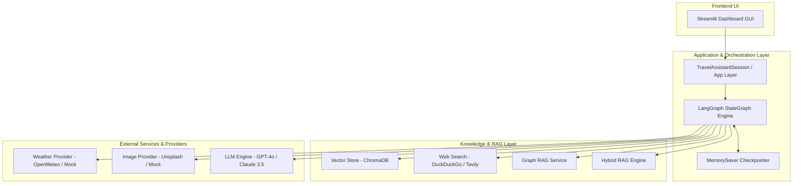
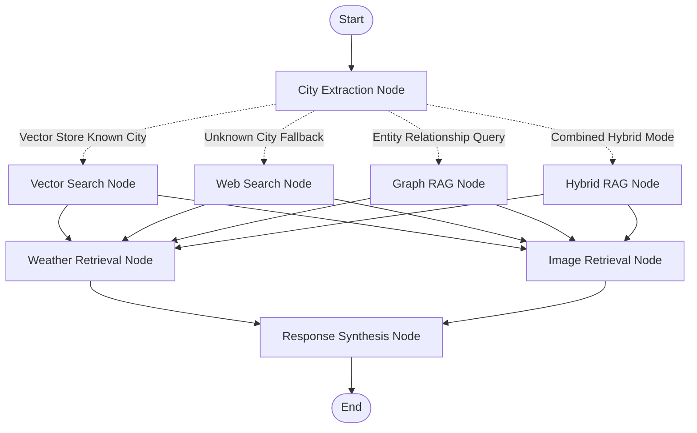

# Multi-Modal Agentic Travel Assistant 🌍✈️

[](https://www.python.org/)
[](https://github.com/langchain-ai/langgraph)
[](https://streamlit.io/)
[](https://www.trychroma.com/)
[](tests/)

An AI Engineering technical challenge implementation of an agentic, multi-modal travel assistant powered by **LangGraph**, **Streamlit**, **ChromaDB Vector Store**, **Graph RAG / Hybrid RAG**, and **OpenAI/Anthropic LLMs**.

---

## Table of Contents

1. [Project Overview](#1-project-overview)
2. [Architecture & Design Principles](#2-architecture--design-principles)
3. [LangGraph Topology & Flow](#3-langgraph-topology--flow)
4. [State Model (`TravelAgentState`)](#4-state-model-travelagentstate)
5. [Routing Logic & Conditional Edges](#5-routing-logic--conditional-edges)
6. [Vector Store Knowledge Retrieval](#6-vector-store-knowledge-retrieval)
7. [Web-Search Fallback Engine](#7-web-search-fallback-engine)
8. [Weather Service Integration](#8-weather-service-integration)
9. [Image Retrieval Service](#9-image-retrieval-service)
10. [Structured Output Contract](#10-structured-output-contract)
11. [Manual Tool Execution Engine](#11-manual-tool-execution-engine)
12. [Parallel Fan-Out & Fan-In Orchestration](#12-parallel-fan-out--fan-in-orchestration)
13. [Checkpointing & Multi-Turn Memory](#13-checkpointing--multi-turn-memory)
14. [Selective Re-Execution Logic](#14-selective-re-execution-logic)
15. [Local Setup & Installation](#15-local-setup--installation)
16. [Mock API Setup (Zero-Credential Running)](#16-mock-api-setup-zero-credential-running)
17. [Environment Variables Reference](#17-environment-variables-reference)
18. [Running the Streamlit Application](#18-running-the-streamlit-application)
19. [Testing & Verification Suite](#19-testing--verification-suite)
20. [Design Decisions, Tradeoffs & Limitations](#20-design-decisions-tradeoffs--limitations)

---

## 1. Project Overview

The **Multi-Modal Agentic Travel Assistant** is designed to provide comprehensive, multi-modal travel briefings for global destinations. Given a user query (e.g., *"Tell me about Tokyo"* or *"What's the forecast for Snohomish?"*), the agent dynamically:

- **Extracts Target Destinations**: Identifies city names and travel intents.
- **Routes Knowledge Queries**: Selects between local vector search (**Paris**, **Tokyo**, **New York**), **Graph RAG**, **Hybrid RAG**, or live **Web Search Fallback** (for unindexed cities like **Snohomish** or **Kyoto**).
- **Retrieves Forecasts & Media Concurrently**: Executes weather forecast lookups (5–7 day predictions) and destination image search in parallel.
- **Synthesizes Typed Briefings**: Returns a strictly typed Pydantic `TravelResponse` containing Markdown summaries, weather data points, and image galleries.
- **Renders Interactive Dashboards**: Displays structured briefings, Altair interactive temperature charts, and image carousels in a Streamlit GUI.

---

## 2. Architecture & Design Principles



### Core Architecture Principles:
- **Contract-First Interfaces**: All backend subsystems communicate through immutable abstract base classes (`models/`, `interfaces/`).
- **Decoupled Frontend**: Streamlit UI components contain zero business logic or graph code.
- **Provider Pattern**: External APIs (OpenWeather, DuckDuckGo, Unsplash) are wrapped in adapter classes (`providers/`) with zero-config `MOCK` fallbacks (`mocks/`).
- **Errors as Data**: Service failures are captured gracefully into state fields without crashing the graph workflow.

---

## 3. LangGraph Topology & Flow

The complete execution workflow is modeled as a compiled LangGraph `StateGraph`:



> 📷 **Architecture Diagram**: A rendered high-resolution PNG diagram of the compiled graph is available in [`graph.png`](./graph.png).

---

## 4. State Model (`TravelAgentState`)

State is managed immutably using Python `TypedDict` (`models/state.py`):

```python
class TravelAgentState(TypedDict, total=False):
    query: str                       # Original raw user query
    city: Optional[str]              # Extracted city name
    retrieval_mode: Optional[str]     # RAG mode: 'vector_store' | 'web_search' | 'graph_rag' | 'hybrid_rag'
    city_knowledge: Optional[str]    # Summary text from vector store, graph, or web search
    graph_entities: Optional[List[Dict[str, Any]]] # Graph RAG entities/relationships
    weather_forecast: Optional[List[Dict[str, Any]]] # List of WeatherDataPoint dictionaries
    image_urls: Optional[List[str]]   # Destination image URLs
    messages: List[Any]              # Conversation message history
    tool_calls: Optional[List[Dict[str, Any]]] # Raw LLM tool calls
    final_response: Optional[Dict[str, Any]] # Serialized TravelResponse schema
    weather_error: Optional[str]     # Graceful weather error message
    image_error: Optional[str]       # Graceful image error message
    search_error: Optional[str]      # Graceful search error message
    reused_fields: Optional[List[str]]# Selective re-execution tracking
```

---

## 5. Routing Logic & Conditional Edges

Routing between retrieval mechanisms is performed via conditional edges (`graph/routing.py`):

1. **Explicit RAG Mode**: If `state["retrieval_mode"]` is set (e.g. `'graph_rag'` or `'hybrid_rag'`), the router routes directly to that node.
2. **Graph Intent Recognition**: Queries mentioning terms like *"relations"*, *"connected"*, *"topology"*, or *"network"* are routed to `graph_rag`.
3. **Vector Store Match**: Cities in the pre-indexed database (**Paris**, **Tokyo**, **New York**) route to `vector_search`.
4. **Web Search Fallback**: Unindexed destinations (e.g., **Snohomish**, **Kyoto**) route automatically to `web_search`.

---

## 6. Vector Store Knowledge Retrieval

Local knowledge is managed via **ChromaDB** (`services/vector_store.py`):

- **Persistence Directory**: `./data/vector_store`
- **Pre-Seeded Cities**: Paris (`data/cities/paris.json`), Tokyo (`data/cities/tokyo.json`), New York (`data/cities/new_york.json`), Kyoto (`data/cities/kyoto.json`).
- **Seeding Utility**: `python scripts/seed_vector_store.py` seeds vector collections automatically.

---

## 7. Web-Search Fallback Engine

When a destination is not found in the local vector store:
- Live Mode uses **DuckDuckGo Search** (`providers/search_live.py`) or **Tavily API** to retrieve live web summaries.
- Mock Mode uses `MockSearchProvider` (`mocks/search.py`) simulating realistic network latency and detailed search results.

---

## 8. Weather Service Integration

Retrieves 5–7 day weather forecasts:
- **Data Model**: `WeatherDataPoint(date, temperature, condition)`
- **Live Provider**: **Open-Meteo API** (`providers/weather_live.py`) requiring no API key for standard usage.
- **Mock Provider**: `MockWeatherProvider` (`mocks/weather.py`) returning realistic daily forecasts with custom weather conditions.

---

## 9. Image Retrieval Service

Fetches high-quality location photographs:
- **Live Provider**: **Unsplash API** (`providers/images_live.py`) fetching real high-res photography.
- **Mock Provider**: `MockImageProvider` (`mocks/images.py`) returning curated Unsplash images for known cities and fallback landscape imagery for unindexed cities.

---

## 10. Structured Output Contract

The final workflow step enforces a strictly typed output (`models/travel.py`):

```python
class WeatherDataPoint(BaseModel):
    date: str
    temperature: float
    condition: str

class TravelResponse(BaseModel):
    city_summary: str
    weather_forecast: List[WeatherDataPoint]
    image_urls: List[str]
    weather_error: Optional[str] = None
    image_error: Optional[str] = None
    search_error: Optional[str] = None
```

- **Pydantic Validation**: Ensures response compliance before returning to UI.
- **Auto-Repair Engine**: If the LLM generates slightly malformed JSON, `llm/structured.py` cleans and repairs JSON payloads automatically.

---

## 11. Manual Tool Execution Engine

The system supports explicit, manual tool execution without relying on implicit LLM agent loops (`graph/tool_executor.py`):
1. **Parses LLM Tool Calls**: Extracts tool names (`get_weather`, `search_images`, `search_city`) and argument dicts.
2. **Dispatches Service Calls**: Executes corresponding backend interfaces directly.
3. **Captures Tool Results**: Wraps results into `ToolMessage` objects and appends them to state history.

---

## 12. Parallel Fan-Out & Fan-In Orchestration

To optimize response latency:
- Once knowledge retrieval (`vector_search`, `web_search`, `graph_rag`, or `hybrid_rag`) completes, the graph **fans out** simultaneously to:
  1. `weather_node`
  2. `image_node`
- Both nodes execute concurrently and **fan in** to `synthesize_response_node`.

---

## 13. Checkpointing & Multi-Turn Memory

State persistence across user turns is powered by LangGraph's `MemorySaver` (`graph/checkpoint.py`):
- **Thread-Scoped Execution**: Each conversation turn uses a unique `thread_id`.
- **Context Retention**: Follow-up questions (e.g., *"What about next week?"*) retain the previously extracted city (`Tokyo`) without requiring the user to repeat it.

---

## 14. Selective Re-Execution Logic

When a follow-up query is issued for the same destination:
- **Reuses Static Data**: Reuses existing `city_summary` and `image_urls`.
- **Refreshes Dynamic Data**: Only re-executes `weather_node` to update forecast information, cutting LLM token usage and latency.

---

## 15. Local Setup & Installation

### Prerequisites:
- **Python 3.11+** installed.

### Setup Instructions:

```bash
# 1. Clone the repository
git clone https://github.com/your-username/Agentic-travel-assistant.git
cd Agentic-travel-assistant

# 2. Create and activate a virtual environment
python -m venv .venv
# On Windows PowerShell:
.venv\Scripts\Activate.ps1
# On Linux/macOS:
source .venv/bin/activate

# 3. Install dependencies
pip install -r requirements.txt # or pip install langchain langgraph streamlit chromadb pydantic httpx pytest

# 4. Seed the local vector store
python scripts/seed_vector_store.py
```

---

## 16. Mock API Setup (Zero-Credential Running)

The application is fully runnable **without any API keys**!

Set the provider mode in `.env` or environment:

```bash
export PROVIDER_MODE=MOCK
```

In `MOCK` mode:
- Weather defaults to `MockWeatherProvider`.
- Images default to `MockImageProvider`.
- Web Search defaults to `MockSearchProvider`.
- Local Vector Search uses ChromaDB offline embeddings.

---

## 17. Environment Variables Reference

Create a `.env` file based on `.env.example`:

```ini
# Execution Mode (MOCK or LIVE)
PROVIDER_MODE=MOCK

# LLM Provider Configuration
LLM_PROVIDER=openai           # 'openai' or 'anthropic'
LLM_MODEL=gpt-4o              # 'gpt-4o', 'gpt-4o-mini', or 'claude-3-5-sonnet-20241022'
OPENAI_API_KEY=sk-...         # Required if PROVIDER_MODE=LIVE
ANTHROPIC_API_KEY=sk-ant-...  # Required if using Anthropic

# External Service Keys (Optional when PROVIDER_MODE=MOCK)
OPENWEATHER_API_KEY=...
TAVILY_API_KEY=...
UNSPLASH_API_KEY=...
VECTOR_STORE_PATH=./data/vector_store
```

---

## 18. Running the Streamlit Application

Launch the graphical dashboard:

```bash
streamlit run app.py
```

Open your browser at `http://localhost:8501`.

### Key GUI Features:
- **RAG Mode Selector**: Choose between *Auto Router*, *Vector Store*, *Graph RAG*, *Hybrid RAG*, and *Web Search*.
- **Interactive Weather Chart**: View 7-day temperature trends with smooth line plots.
- **Image Gallery**: Carousel display of high-resolution destination images.
- **Error Banners**: Non-blocking warning banners if an external provider experiences partial downtime.

---

## 19. Testing & Verification Suite

The repository includes a comprehensive `pytest` test suite covering all modules:

```bash
# Run the complete test suite
pytest -v
```

### Test Suite Breakdown (30 Tests):
- `tests/test_vector_store.py`: Tests ChromaDB indexing, lookup, and fallback behavior.
- `tests/test_structured_output.py`: Tests `TravelResponse` Pydantic parsing and auto-repair.
- `tests/test_tool_executor.py`: Tests manual tool call parsing and execution.
- `tests/test_graph.py`: Tests routing, sequential/parallel node execution, and end-to-end graph invocation.
- `tests/test_live_adapters.py`: Tests live provider fallback mechanisms.
- `tests/test_e2e_scenarios.py`: Verifies all 5 mandatory end-to-end scenarios (known city, unknown city, multi-turn memory, selective re-execution, service failure resilience).

---

## 20. Design Decisions, Tradeoffs & Limitations

### Key Design Decisions:
1. **LangGraph Over Standard Chains**: Provides fine-grained state management, conditional branch routing, and parallel execution nodes.
2. **Immutable State**: Prevents state pollution across concurrent graph nodes.
3. **Pydantic Validation Guardrails**: Guarantees clean API contracts between backend graph and Streamlit frontend.

### Known Limitations:
- **In-Memory Checkpointing**: Default `MemorySaver` retains conversation history in RAM during server runtime. Production deployments can swap to `PostgresSaver`.
- **Live Search Rate Limits**: Standard DuckDuckGo web search may enforce temporary rate limits under high query volume; `MOCK` mode provides 100% uptime for demonstration.

---

*Developed with ❤️ as part of the Multi-Modal Agentic Travel Assistant Challenge.*
